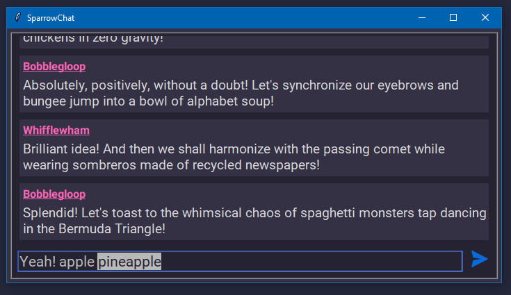

    <h1>SparrowChat</h1>
     
    
    
Application view in windows

## Features
* Responsive Layout
* Dark theme
* Scrollable chat
* Scrollable multiline text input
* Word wrap on chat messages

## Bugs

1. Unresponsive and flickering window (very low chance)

Whats the problem?

This can happen when the window has not fixed geometry and `update_idletasks` called in 
`ChatBox.add_message` and `ChatBox.add_notification`.

What causes the problem?

The root cause is the `MsgBody.configure_wrap` as it configures the width configure event 
is created and hence, the method is binded to configure event it again configures and infinite 
configuring and wrap happens.

